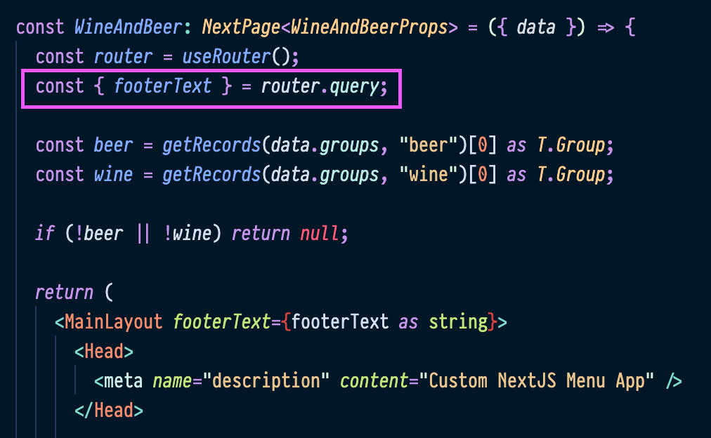

# Gotts Custom Menu App

The Gotts Custom Menu App contains several menu boards that are connected to the Raydiant Menu API.

**URLs**

- Eats and Drinks Menu Board: https://gotts-menu.vercel.app/menu-boards/eats-and-drinks
- Wine and Beer Menu Board: https://gotts-menu.vercel.app/menu-boards/wine-and-beer
- Late Night Flyer: https://gotts-menu.vercel.app/menu-boards/flyer.jpg

## Prerequisities

- Node (version defined in `.nvmrc`)
- Yarn

## Development

First, run the development server:

```bash
yarn dev
```

## Adding app to Raydiant Platform

See [here](https://raydiant.notion.site/How-do-I-develop-an-app-487d7064eeec402fb7d376a5f6e6eed9) for a comprehensive guide to building Raydiant apps.

## Builder Inputs

There are two builder inputs for this project. These can be configured after creating a new app in [Raydiant's Developer portal](https://developers.raydiant.com/)

- Menu Board (select input) - Corresponds to a route in NextJS
  

- Footer Text (text input) - Corresponds to a query param
  
  [Code to retrieve query param](https://github.com/mirainc/custom-menu-samples/blob/79e4388df4cfdb948efaf1b7ca9c29952a927b94/gotts-menu/pages/menu-boards/wine-and-beer.tsx#L38-L39)
  

# Deployment

CI/CD is setup to deploy our apps using the [Vercel Platform](https://vercel.com/new?utm_medium=default-template&filter=next.js&utm_source=create-next-app&utm_campaign=create-next-app-readme)

Check out our [Next.js deployment documentation](https://nextjs.org/docs/deployment) for more details.
