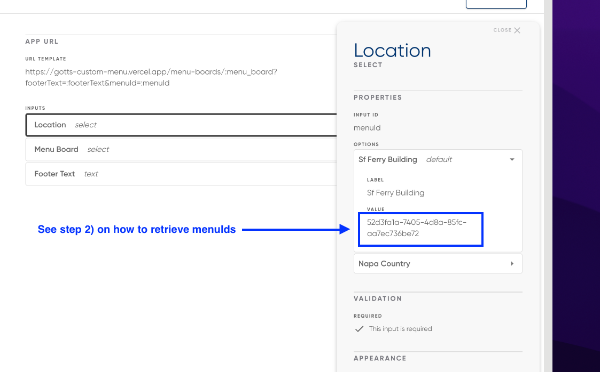

# Gotts Custom Menu App

The Gotts Custom Menu App contains several menu boards that are connected to the Raydiant Menu API.

**URLs**

_Note: Instructions on how to fetch available `menuIds` for a given API key are available in the "Multi-location support" section below._

_Example menuId: 52d3fa1a-7405-4d8a-85fc-aa7ec736be72_

- Eats and Drinks Menu Board: https://gotts-custom-menu.vercel.app/menu-boards/eats-and-drinks?menuId={menuId}
- Wine and Beer Menu Board: https://gotts-custom-menu.vercel.app/menu-boards/wine-and-beer?menuId={menuId}
- Late Night Flyer: https://gotts-custom-menu.vercel.app/menu-boards/flyer.jpg

## Prerequisities

- Node (version defined in `.nvmrc`)
- Yarn

## Development

First, run the development server:

```bash
yarn dev
```

## Adding App to Raydiant Platform

See [here](https://raydiant.notion.site/How-do-I-develop-an-app-487d7064eeec402fb7d376a5f6e6eed9) for a comprehensive guide to building Raydiant apps.

## Builder Inputs

There are three builder inputs for this project. These can be configured after creating a new app in [Raydiant's Developer portal](https://developers.raydiant.com/)

### 1) Location - corresponds to a query param

- Input type: Select
  

### 2) Menu Board - corresponds to a route

- Input type: Select
  

### 3) Footer Text - corresponds to a query param

- Input type: Text
  

## Fetching Menu Data

To fetch menu data, we need to make sure we've tagged the necessary groups in Toast first. Additionally, if you have several version of your menu, e.g. different menus for different locations, you'll also need to follow the "Multi-location/menu support" guide below.

Base API URL:

```
https://menu-api.staging.raydiant.com/v1/groups?tags=<tag>&menus=<menuId>&depth=<depth>
```

Params:

`tags`: filter for tags

`menus`: filter for `menuIds`

`depth`: set depth for returned payload


> **⚠ Important:** All items in Toast must have the visibility field set to "kiosk" otherwise our API won't return the resource.

### Configuring tags

Tags are the recommended way of fetching data for a particular group. Follow the steps below to add tags to your menu groups:

1. Go to your Toast sandbox
2. Select your menu (e.g Gotts Roadside - SF Ferry Building)
3. Find all relevant groups that require tagging
4. Add a tag to each group

5. Confirm you are able to make an API request to fetch group data

```
/v1/groups?tags=<tag>&depth=<depth>
```

### Multi-location/menu support

A couple of additional steps are required for multi-location/menu support.

1. Using your API key, make a call to `/v1/menus` to retrieve the list of menus your API key has access to

**cURL example:**

```
curl --location --request GET 'https://menu-api.raydiant.com/v1/menus' \
--header 'x-api-key: <API_KEY>'
```

2. Take note of all the `menuIds` required for your digital menu
3. Go to the developer portal and select your app
4. Creat a new "select" builder input
5. Populate the "options" section with the aforementioned `menuIds`
   

### Modifiers

Toast modifiers aren't fully supported yet. Modifier-like behaviour can be achieved through tags + items.
In the example below, there's a total of three different modifiers


1. Price sizing
2. Flavours
3. Additional Flavours

**Price Sizing:**

1. In Toast, add price sizing to the desired menu item
   
2. On the same item, add the `size` tag to the item

**Flavours:**
In this example, flavours are `items` on the "Fountain Soda" sub-group.

**Additional Flavours:**
In this example, additional items are `items` with the addition of a `additional-flavour` tag so the frontend can filter these out from the other flavours.

## Deployment

CI/CD is setup to deploy our apps using the [Vercel Platform](https://vercel.com/new?utm_medium=default-template&filter=next.js&utm_source=create-next-app&utm_campaign=create-next-app-readme)

Check out our [Next.js deployment documentation](https://nextjs.org/docs/deployment) for more details.
