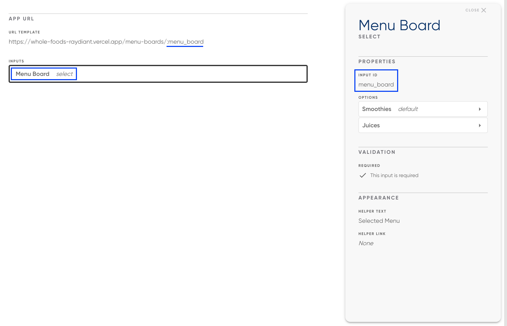

# NextJS Custom Menu App

**URLs**

- Juices Menu Board: https://whole-foods-raydiant.vercel.app/menu-boards/juices
- Smoothies Menu Board: https://whole-foods-raydiant.vercel.app/menu-boards/smoothies

## Prerequisities

- Node (version defined in `.nvmrc`)
- Yarn

## Development

First, run the mock API server:

```bash
yarn start:mock-server
```

Then start the development server

```bash
yarn dev
```

## Adding App to Raydiant Platform

See [here](https://raydiant.notion.site/How-do-I-develop-an-app-487d7064eeec402fb7d376a5f6e6eed9) for a comprehensive guide to building Raydiant apps.

## Builder Inputs

There is one builder input for this project. Builder inputs can be configured after creating a new app in [Raydiant's Developer portal](https://developers.raydiant.com/)

- Menu Board (select input) - Corresponds to a NextJS route
  

# Deployment

CI/CD is setup to deploy our apps using the [Vercel Platform](https://vercel.com/new?utm_medium=default-template&filter=next.js&utm_source=create-next-app&utm_campaign=create-next-app-readme)

Check out our [Next.js deployment documentation](https://nextjs.org/docs/deployment) for more details.
