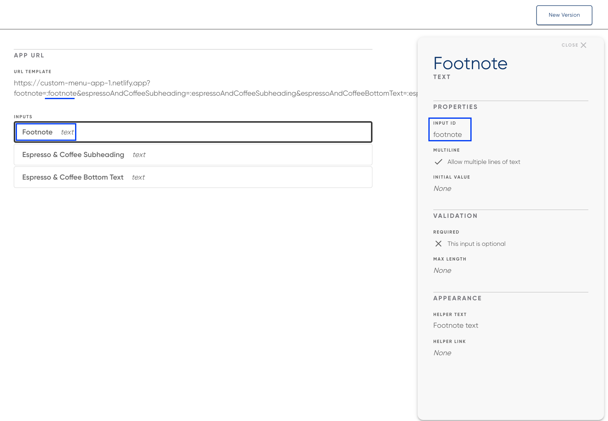
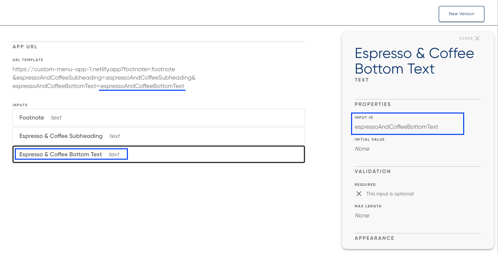
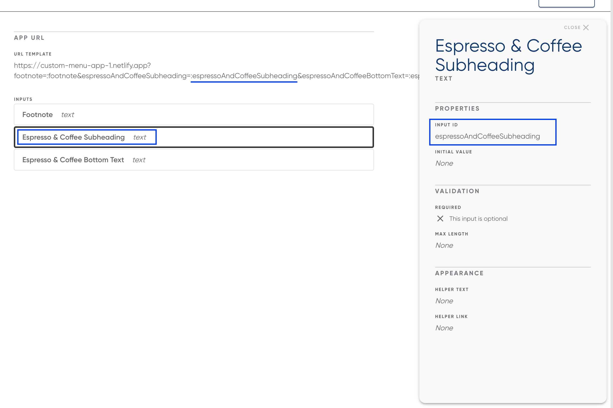

# Vanilla JS Custom Menu App

**URLs**

- Main Menu Board: https://custom-menu-app-1.netlify.app

## Prerequisities

- Static file server like [Serve](https://www.npmjs.com/package/serve)

## Development

Run your static file server:

E.g.

```bash
serve .
```

## Adding App to Raydiant Platform

See [here](https://raydiant.notion.site/How-do-I-develop-an-app-487d7064eeec402fb7d376a5f6e6eed9) for a comprehensive guide to building Raydiant apps.

## Builder Inputs

There are three builder inputs for this project. These can be configured after creating a new app in [Raydiant's Developer portal](https://developers.raydiant.com/)

- Footnote (text input) - Corresponds to a query param
  
- Bottom Text (text input) - Corresponds to a query param
  
- Subheading (text input) - Corresponds to a query param
  

[Code to retrieve query param](https://github.com/mirainc/custom-menu-samples/blob/8ae608baa41ffefbfc8cc63d0f0abc8011f97726/vanilla-js/js/scripts.js#L84-L88)

# Deployment

CI/CD is setup to deploy our apps using the [Neflify](https://www.netlify.com/)
